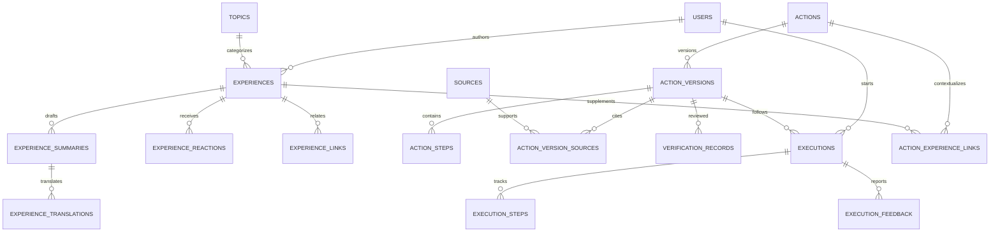

# Culture Bridge 資料庫草案

這份 schema 依目前介面與產品文件，支援「制度流程」及「生活經驗」兩條主線。先用 **SQLite 3.37+**，方便在本機閱讀與驗證；這是待你確認的資料模型，尚未接到 React，也未建立正式資料庫。

SQL：[database/schema.sql](../database/schema.sql)

## 先回答你可能會問的問題

| 可能的問題 | 使用的資料 |
| --- | --- |
| ARC／工作證現在怎麼辦？ | `actions`、最新已發布 `action_versions`、`action_steps` |
| 這份流程適用哪個學校／哪類學生？ | 版本的 `institution_id`、`applicable_to`；執行紀錄的身分類型 |
| 這個資訊誰確認的？依據是什麼？何時確認？ | `verification_records`、`sources`、`action_version_sources` |
| 最近 30 天有人照這個版本辦成功嗎？ | `executions` 的版本、結果與完成時間 |
| 哪一步最多人卡住？ | `execution_feedback` 的步驟與日期；以不同執行紀錄去重 |
| 我現在做到哪裡？ | `executions`、`execution_steps` |
| 大家遇到哪些文件、費用或資格差異？ | `execution_feedback.category`、原始回報與審查狀態 |
| 教授說「再看看」，其他學生怎麼理解？ | `experiences`、`experience_summaries`、`experience_links` |
| 有沒有和我一樣身分的生活經驗？ | 經驗的主題、身分類型與發布狀態 |
| 我的經驗不同，可以補充嗎？ | 新建完整經驗，再以 `experience_links.kind='different'` 連回原文 |
| AI 整理是否經本人同意？ | 摘要的 `confirmed_by`、`confirmed_at`、原文快照 |
| 切英文之後還能看原文嗎？ | 原文獨立保存；`experience_translations` 綁定摘要版本 |
| 我分享了幾篇？多少人覺得有幫助？ | 經驗作者及 `experience_reactions`，即時計算，不儲存人工計數 |
| 流程改版之後，我之前的進度會跑掉嗎？ | 執行紀錄綁定固定版本，舊步驟保留 |

## 資料關聯



SQL 使用小寫表名；圖中為方便閱讀使用大寫。

## 核心設計決定

### 1. 經驗和官方流程分開

`experiences` 沒有 `verified` 或「正確率」。有幫助代表讀者反應，不代表事實正確。

`action_versions` 才有 `unverified / community_supported / needs_review / verified / outdated`。學生回報不會自動變成驗證結果；設為 `verified` 前須有具來源關聯的 reviewer/admin 審查紀錄。

文件目前對首頁優先順序有兩種描述，這個 schema 不決定首頁排序，因此兩種產品方向都能使用。

### 2. 流程改版不改掉歷史

`actions` 是任務本身，例如工作證；`action_versions` 是任務第 1、2、3 版。每次執行記錄固定跟隨其中一版。

發布後，版本的內容及步驟由 trigger 保護；更新內容應新建版本。驗證狀態仍可調整，例如把舊版改成 `outdated`。來源頁面本身可能變動，正式導入時還應保存來源文件快照／雜湊。

`latest_published_actions` 取得最高版本號的已發布版本；這不代表它一定 verified，API 必須一起回傳驗證狀態。

### 3. 原文、AI 摘要與翻譯分開

分享流程：

1. 建立 `experiences`，狀態 `draft`。
2. 建立 `experience_summaries`，保存本次輸入原文 `source_voice` 及模型名稱。
3. 作者確認摘要，填入自己的 `confirmed_by` 和確認時間。
4. 在同一筆發布操作中指定 `confirmed_summary_id`、`published_at`，改為 `published`。

資料庫會檢查：摘要屬於這篇經驗、確認者是作者、摘要原文快照和現在原文相同。不能拿舊原文的確認結果發布新原文。

已發布摘要不能直接覆寫；若編輯原文，先將經驗改回 `draft`，建立新版摘要，再確認發布。翻譯綁定摘要版本，避免改摘要後仍誤用舊翻譯。

### 4. 匿名是對外匿名

後端保留 `author_id`，才能管理自己的內容與避免重複反應。`users` 只保存外部登入系統識別碼，不保存密碼、真實姓名或學號。

公開讀取優先使用 `public_experiences`，不回傳作者識別碼或可辨識的選填學校／地點。這個 view 是欄位投影，**不等同授權機制**；API 仍須驗證登入、所有權與管理員權限，不能讓瀏覽器直接操作資料庫。自由文字本身也可能含個資，需在發布流程處理。

### 5. 結果與差異不同

- `outcome='success'`：使用者回報完成。
- `outcome='failed'`：使用者回報未完成。
- `outcome='different'`：回報流程不同；未假設一定成功。
- `outcome='abandoned'`：明確結束嘗試。
- `outcome IS NULL`：仍進行中。

進行中紀錄不能算失敗。「流程不同但有成功」可以用 `outcome='success'` 加一筆 `kind='different'` 回報表示。

### 6. 避免把反應計數寫死

每人對同一經驗、同一反應最多一筆。取消有幫助就是刪除該反應；`public_experiences` 即時計算。自己的 impact 以去重讀者數和反應次數分別呈現，兩者不能混稱。

`experience_links` 是有方向的：原文 → 補充／相似經驗。查詢雙向相似關係時要同時查兩端；不同經驗數只計公開的補充經驗。

## 範例 SQL

以下 `:user_id`、`:version_id` 等是 API 傳入的綁定參數，不能用字串拼接使用者輸入。時間统一用 UTC ISO 8601 格式；前端再換成台北時間。

### Q1：最新可見流程及來源

```sql
SELECT v.action_id, v.id AS version_id, v.title_zh,
       v.verification_status, v.applicable_to, i.name_zh AS institution,
       (SELECT MAX(r.checked_at) FROM verification_records r
         WHERE r.action_version_id=v.id AND r.decision='verified') AS last_verified_at
FROM latest_published_actions v
LEFT JOIN institutions i ON i.id=v.institution_id;

SELECT s.title, s.url, s.publisher, s.accessed_at, link.evidence_note
FROM action_version_sources link JOIN sources s ON s.id=link.source_id
WHERE link.action_version_id=:version_id;
```

最後驗證時間是歷史上的最後一次 verified 審查；需搭配目前狀態顯示，不能只看日期就稱為有效。

### Q2：近 30 天有多少人完成？完成比例怎麼算？

```sql
SELECT COUNT(*) AS finished_attempts,
       COUNT(DISTINCT CASE WHEN outcome='success' THEN user_id END) AS successful_students,
       SUM(CASE WHEN outcome='success' THEN 1 ELSE 0 END) AS successful_attempts,
       ROUND(100.0 * SUM(CASE WHEN outcome='success' THEN 1 ELSE 0 END)
         / NULLIF(SUM(CASE WHEN outcome IN ('success','failed') THEN 1 ELSE 0 END),0),1)
         AS success_pct_among_explicit_results
FROM executions
WHERE action_version_id=:version_id
  AND finished_at >= strftime('%Y-%m-%dT%H:%M:%fZ','now','-30 days');
```

這是「近 30 天回報成功／失敗者的成功比例」，不是所有開始辦理者的完成率。沒有樣本時比例為 NULL，不能顯示 0% 或保證適用。

### Q3：近 30 天哪些步驟被回報卡住？

```sql
SELECT s.position, s.title_zh, COUNT(DISTINCT f.execution_id) AS stuck_attempts
FROM action_steps s
JOIN execution_feedback f ON f.step_id=s.id AND f.action_version_id=s.action_version_id
WHERE s.action_version_id=:version_id AND f.kind='stuck'
  AND f.review_state <> 'dismissed'
  AND f.created_at >= strftime('%Y-%m-%dT%H:%M:%fZ','now','-30 days')
GROUP BY s.id,s.position,s.title_zh
ORDER BY stuck_attempts DESC,s.position;
```

這是回報次數，不是卡關率。卡關率還需要「實際到達該步驟的人次」事件，這份草案尚未加入該事件。

### Q4：我的進度，包含還沒碰過的步驟

```sql
SELECT s.position,s.title_zh,COALESCE(p.state,'pending') AS state
FROM executions e
JOIN action_steps s ON s.action_version_id=e.action_version_id
LEFT JOIN execution_steps p ON p.execution_id=e.id AND p.step_id=s.id
WHERE e.id=:execution_id AND e.user_id=:user_id
ORDER BY s.position;
```

### Q5：找公開的相似生活經驗

```sql
SELECT * FROM public_experiences
WHERE topic_id=:topic_id
  AND (:identity_type IS NULL OR identity_type=:identity_type)
ORDER BY published_at DESC,id
LIMIT :page_size OFFSET :offset;
```

目前這是主題／身分篩選，不是語意搜尋。要回答「教授語氣是否拒絕」這種精準自然語言問題，後續需補情境標籤、全文搜尋或向量檢索；不要把同主題直接宣稱為同情境。

### Q6：這篇經驗的不同回應

```sql
SELECT other.* FROM experience_links link
JOIN public_experiences other ON other.id=link.to_experience_id
WHERE link.from_experience_id=:experience_id AND link.kind='different'
ORDER BY other.published_at DESC;
```

### Q7：我的分享與影響數字

```sql
SELECT COUNT(*) AS published_shares FROM experiences
WHERE author_id=:user_id AND status='published';

SELECT COUNT(*) AS helpful_reactions,
       COUNT(DISTINCT r.user_id) AS distinct_helped_students
FROM experience_reactions r JOIN experiences e ON e.id=r.experience_id
WHERE e.author_id=:user_id AND e.status='published'
  AND r.kind='helpful' AND r.user_id<>:user_id;
```

第二個數字才適合叫「幾位學生覺得有幫助」；同一人按兩篇不會被算成兩位。

## 這版刻意留待後續的項目

- 獨立的 procedure 問答貼文／留言和知識庫：目前用正式流程、回報和經驗支援現有 UI，未一次實作產品地圖的全部遠期物件。
- 搜尋紀錄、閱讀／到達步驟事件、推薦與回訪 KPI：目前只能計算已記錄的發布、反應、執行和回報。
- JSON 形式的完整適用條件、必要文件清單與多語種流程：目前適用說明與步驟文字足夠起步，但不能自動判斷法規資格。
- AI 工作佇列、實際模型 API、通知與內容檢舉。
- 身分驗證、資料存取授權、審查完整狀態機及刪除／匿名化策略。
- SQLite 沒有 PostgreSQL RLS；多人正式上線時可評估 PostgreSQL。UUID 暫用 API 產生的 TEXT，未綁定任何登入供應商。

## 如何檢查

每個 SQLite connection 都必須設定 `PRAGMA foreign_keys=ON`；此檔只會設定執行它的那個 connection。這是一次性建表草案，不是可重複套用的 migration，不要直接套在已有同名資料表的資料庫。

本機記憶體驗證：

```powershell
.venv\Scripts\python.exe database\test_schema.py
```

驗證表與外鍵建立、發布確認、流程驗證，以及執行紀錄不可引用別的版本步驟。測試不會產生正式資料庫檔。
